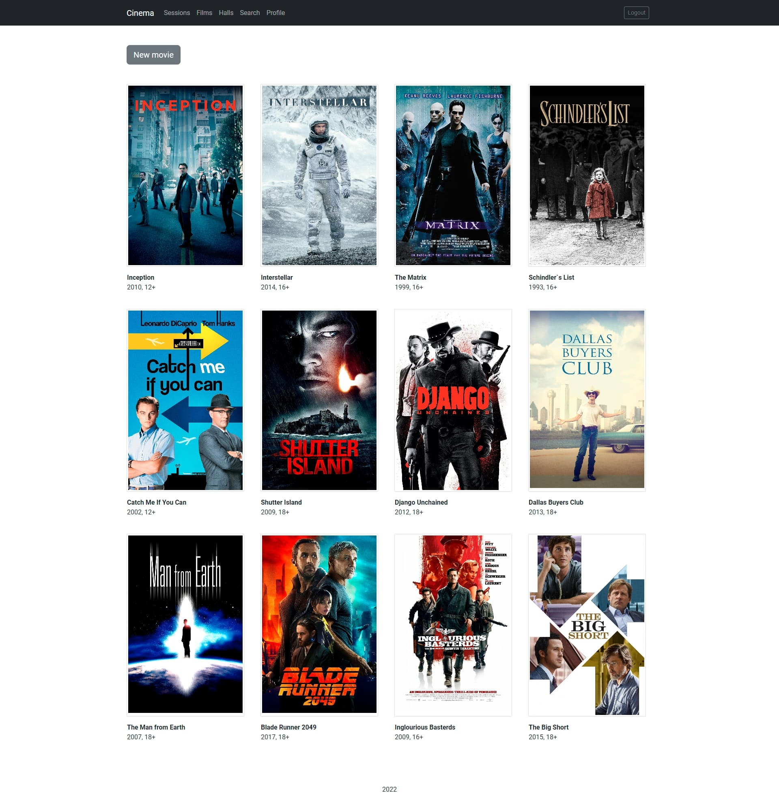
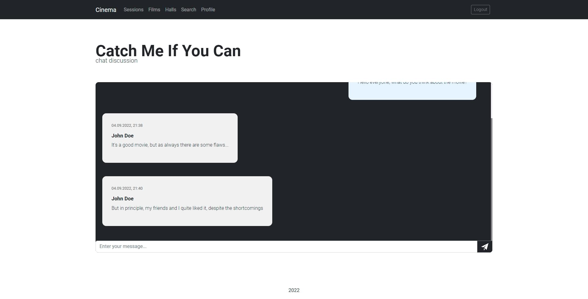

<h1 align="center">SpringBoot</h1>
<p align="center">Web application for cinema management: WebSocket live chat, user roles, localization, validation and mailing</p>

<p align="center">
	
	
</p>

<br/>

## :package:  Technology stack

* Spring
* Spring Boot
* Spring Data JPA
* Spring Security
* Spring WebSocket
* Spring Mail
* H2 Database
* Liquibase
* Mapstruct
* Lombok
* Freemarker

## :ledger:  Features

* Authorization and registration
* Account activation via email
* Localization: English and French
* Forms validation
* CSRF-attack protection
* Different user roles
  * User:
    * Viewing and searching for movie sessions
    * Discussion of films in chat
  * Administrator:
    * User privileges
    * Creation of cinema halls
    * Creation of films
    * Creation of sessions

## :zap:  Quick start

**Step I:** Make sure you have JDK 1.8+ and Maven installed

**Step II:** Configure SMTP credentials at `src\main\resources\application.yaml`

**Maven basic endpoints:**

```JavaScript
// Compile, build and run the application
$> mvn spring-boot:run

// Clean target folder which is created after build
$> mvn clean
```

<br/>

## :factory: Some examples

**Films page**



<br/><br/>

**Chat page**



<br/><br/>